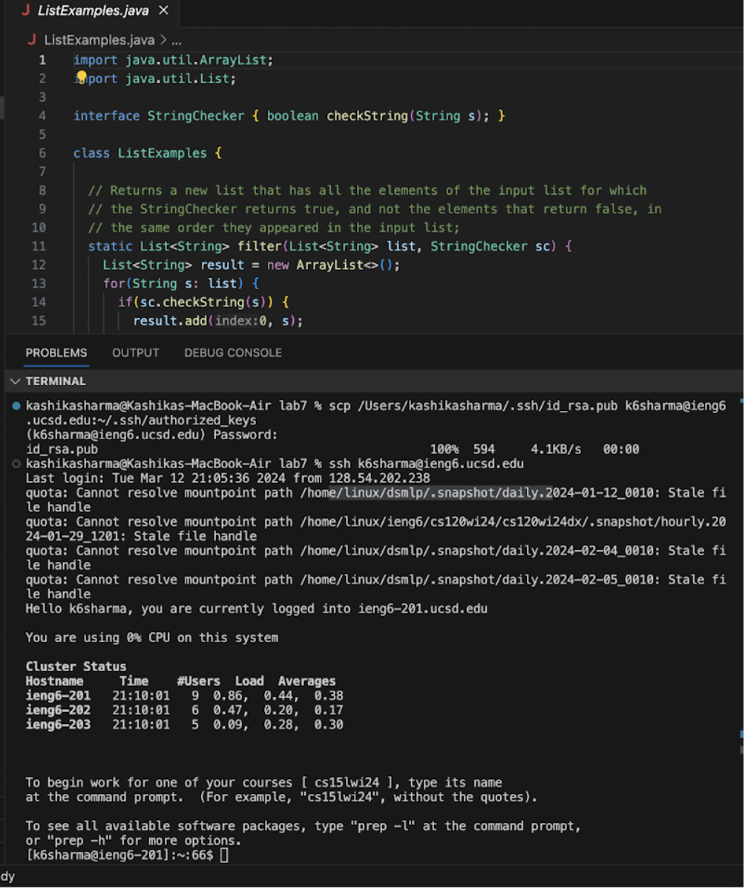
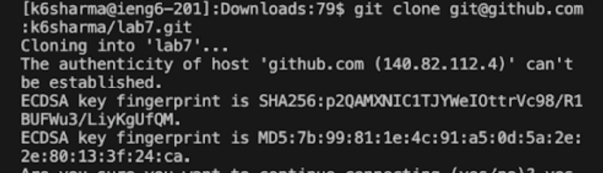
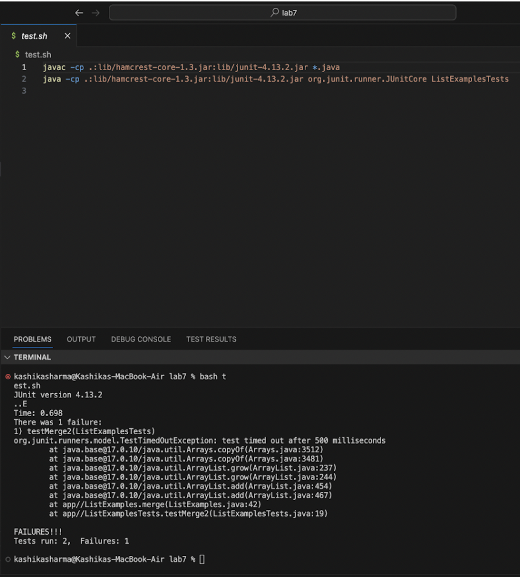
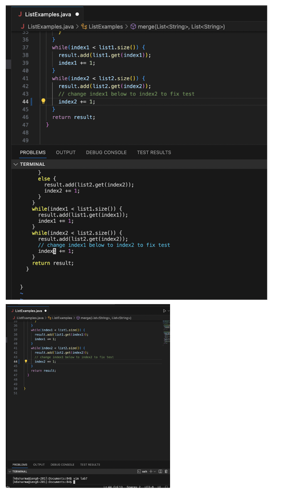

4. Log into ieng6
Keys pressed: <up><up><up><enter> The ssh k6sharma@ieng6.ucsd.edu command was 3 up in the search history so I used the up arrow to access and run it.

5. type `git clone`
Navigate to the github page with the forked lab7 repository 
Click `Code`
Click `SSH`
Click the `copy URL to keyboard` option
Navigate back to VScode and do `Ctrl+V` to paste in the SSH url
Press <enter>

6. type `bash test.sh`

7. type `vim lab7`
Scroll down to ListExamples (5 `j` keypresses)

<ENTER>  
  
Use `j` to scroll down to line 44 (44 `j`)  

Use `l` to scroll right so the cursor hovers over the `2` in `index2` (11 `l`)  

press `x` to delete the `2`  

Press `i` to enter insert mode  

Type `2`  

Then type <ESC> to go back to normal mode  

Type `:wq` to save and exit vim  

9. Keys pressed: <up><up><enter> The “bash test.sh” command was 2 up in the search history so I used the up arrow to access and run it.

10. Wrote:
git commit -m "all done!"
git push origin lab7

