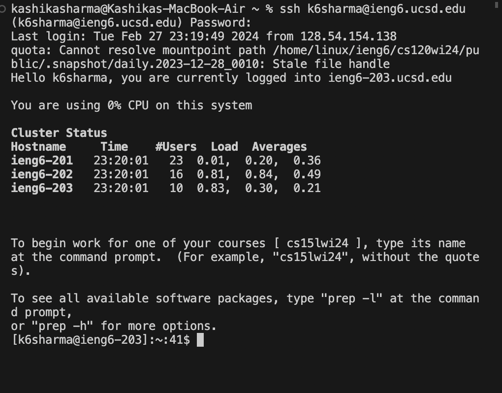
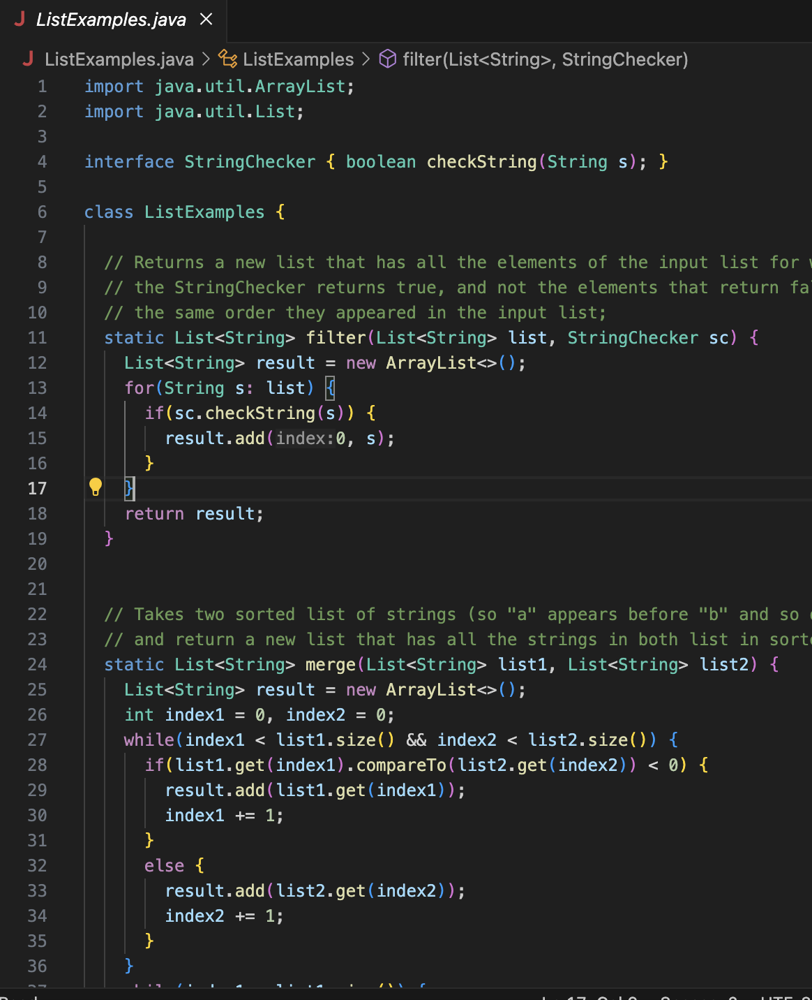
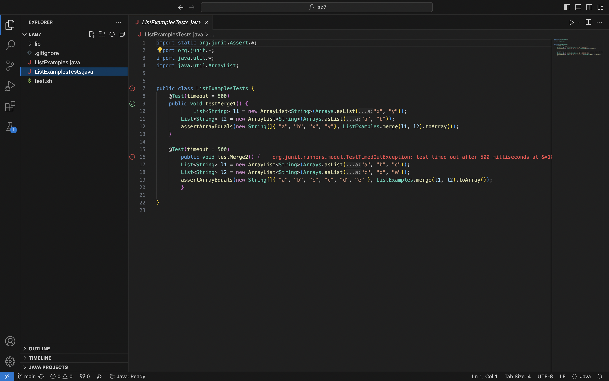

Steps 4-9
4. Log into ieng6

 
5. Clone your fork of the repository from your Github account (using the SSH URL)

 
7. Run the tests, demonstrating that they fail

Edit the code file to fix the failing test
Run the tests, demonstrating that they now succeed
Commit and push the resulting change to your Github account (you can pick any commit message!)

