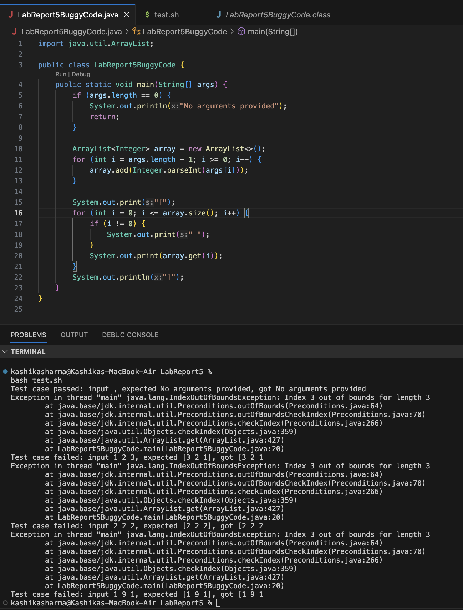
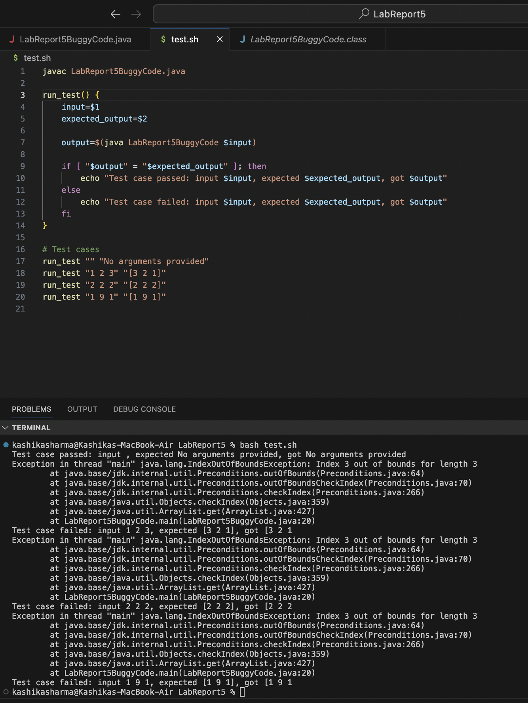
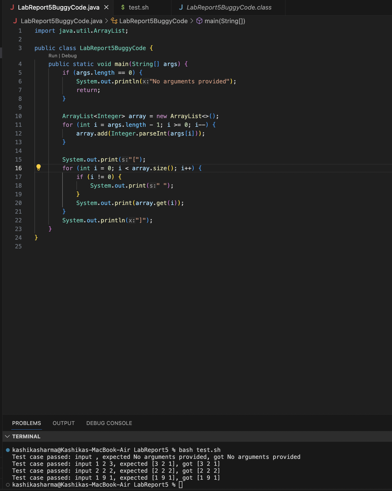

Student post:  
Hey everyone,  
I'm working on my array reversal method, and I keep running into multiple index out of bounds exceptions when I run my bash file (test.sh). I’m not sure how to fix it, but my guess is that I might have messed up one of my for-loops? I’ve attached screenshots below of both my files (I have a java file with the array reversal method and a bash file with my tests, both saved in the LabReport5 directory) so you can see what I’m talking about and can hopefully help troubleshoot. Any help would be appreciated!  

  
  

    

Response from TA:  
Hey there,  
Thank you for reaching out and providing detailed information about the issue you're encountering with your array reversal method. From the screenshots and descriptions you've shared, it seems like there's a problem with the way the program is handling the array indices.  
To troubleshoot this issue, could you try checking the loop conditions in your Java file? Specifically, take a closer look at the loop that prints the reversed array. Pay attention to the loop variable and the termination condition.  
Feel free to give that a try and let me know if you make any progress!  

  

How the student fixed it:  
The feedback made the student look closer at the loop that prints the reversed array. The loop condition checks if `i` is less than or equal to the size of the array, which leads to an index out of bounds exception when `i = array.size`. This happens due to arrays being 0-indexed. For example, if an array size is 7, then the `i` values would be 0 1 2 3 4 5 6. Notice how there is no `i = 7` in an array of size 7. This means that the i cannot equal `array.size`, it must be less. Since the loop condition was formerly  `i <= array.size()`, it causes the program to attempt to access an element beyond the bounds of the array, resulting in the IndexOutOfBoundsException. To fix this bug, the loop condition needs to be modified to `i < array.size()`. As you can see, the tests passed (with the command bash test.sh) after this correction:  

  
  

Reflection:
My favorite topic so far in the second half of the quarter has been file exploration using solely the command line. It’s so interesting to be able to navigate through files that I’ve been looking at for years, but using the command line instead of a file explorer. Other interesting functions I learned to do - such as using `>` for output redirection and using `grep` to find and print all lines that match a given string - have also struck me as very efficient and useful commands. Overall, I am all about shortcuts and working smarter instead of harder, and I’m glad to have learned so many ways to do exactly that in this class

