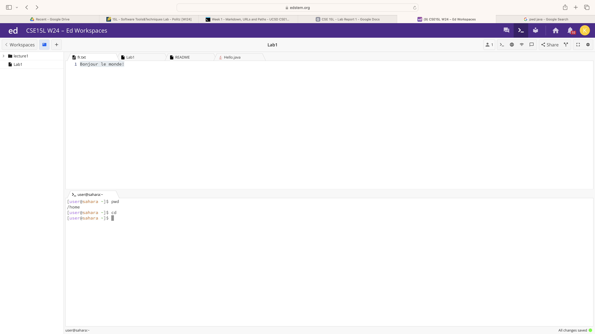
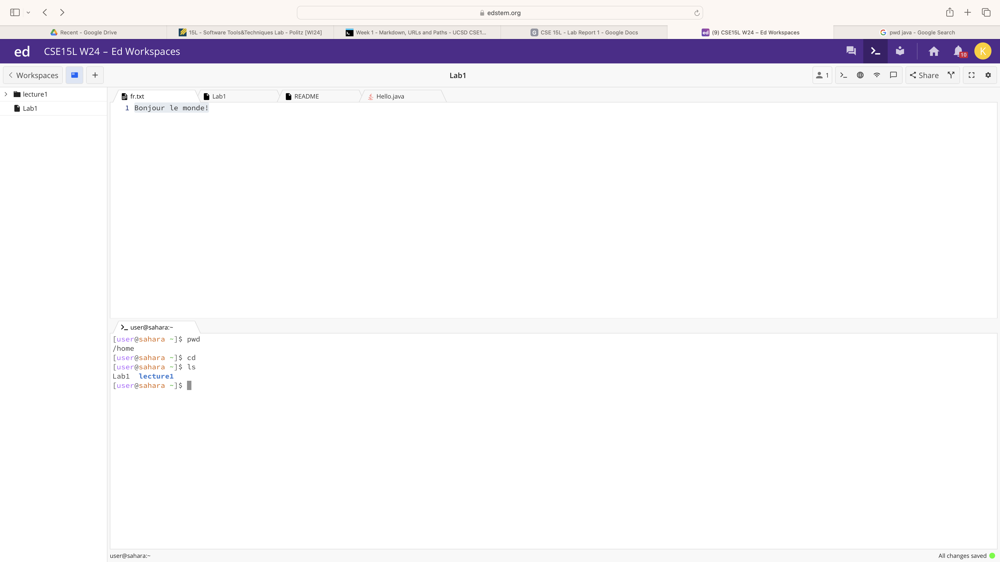
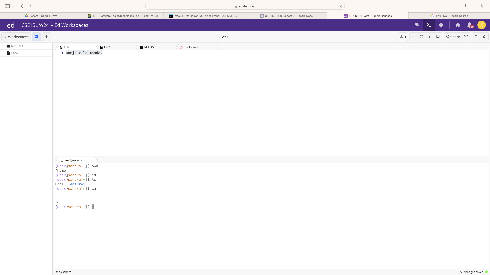
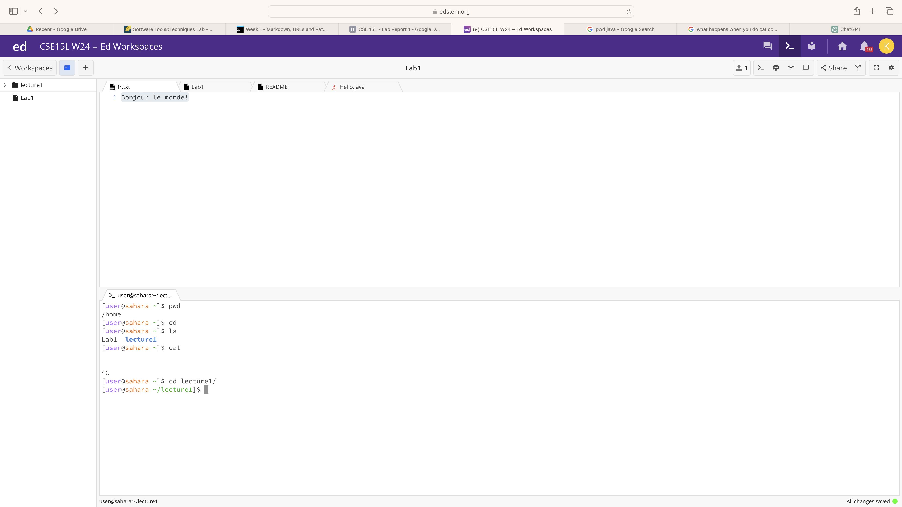
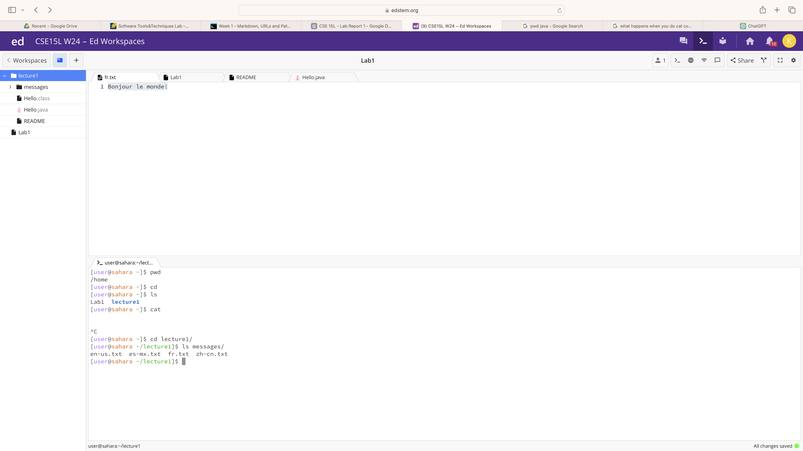
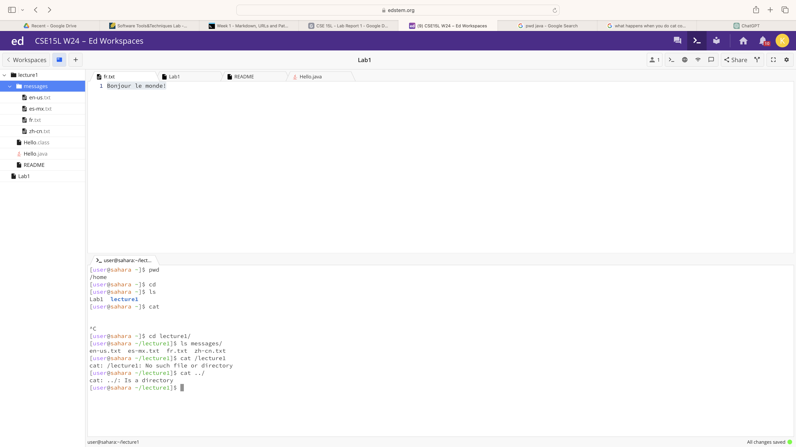
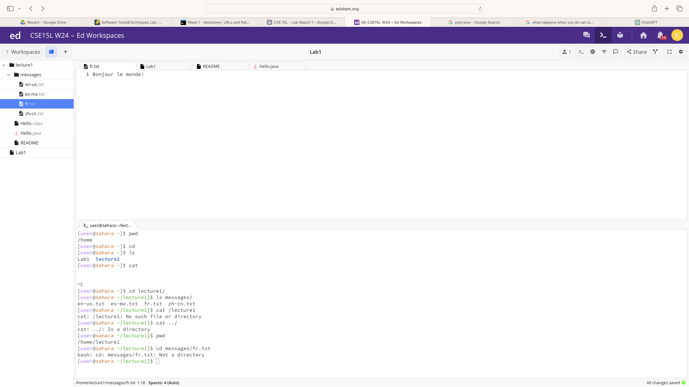

1. `cd`(no arguments)
   
   - The working directory when the command was run was the `home` directory
   - The `cd` command with no arguments takes us to the `home` directory automatically
   - The output is not an error

2. `ls`(no arguments)
   
   - The working directory when the command was run was the home directory
   - The `ls` command with no arguments lists the contents of the working directory (which in this case is the `home` directory, and its contents included the `Lab1` file and the `lecture1` directory)
   - The output is not an error
  
3. `cat`(no arguments)
   
   - The working directory when the command was run the `home` directory
   - _______________________________
   - The output is not an error
     
4. `cd` (with a path to a directory as an argument)
   
   - The working directory when the command was run was the `home` directory
   - The command `cd lecture1/` successfully changed the working directory to `lecture1`
   - The output is not an error
     
5. `ls` (with a path to a directory as an argument)
   
   - The working directory when the command was run was the `lecture1` directory
   - The command `ls messages/` simply listed the contents of the `messages` directory, which were the following files: `en-us.txt`, `es-mx.txt`, `fr.txt`, and `zh-cn.txt`
   - The output is not an error

6. `cat` (with a path to a directory as an argument)
   
   - The working directory when the command was run was the `lecture1` directory
   - The command `cat ../` contains a path to the `home` directory as an argument, and it simply results in a message that points out that the given argument is a path to a directory
   - The output is an error since the `cat` command fails to work when the argument is a directory. It can only display the contents of a file
  
7. `cd` (with a path to a file as an argument)
   
   - The working directory when the command was run was the `lecture1` directory
   - The command `cd messages/fr.txt` results in a message stating that the provided argument file is not a directory
   - The output is an error since the command `cd` only works with directories, as it is a command that stands for "change directory". Thus it fails to work when the argument is a file path.
     

