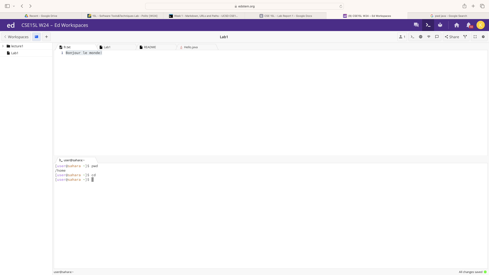

1. `cd`(no arguments)
   
   - The working directory when the command was run was the home directory
   - The `cd` command with no arguments takes us to the home directory automatically
   - The output is not an error

